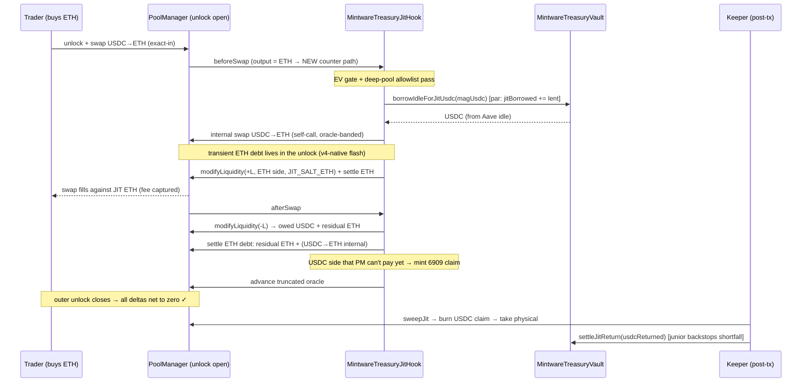

# Phase 2 — Flash-Sourced Atomic JIT "ETH Leg" (research + buildable design)

> **Status: research + design only. Testnet + unaudited; the flash-sourced ETH leg described here
> has NO code path today.** The only mainnet contract in this repo is **AIAttribution v3** on Base
> (`0x11Ef2c7D…C421`). Every vault/hook/MEV contract is Base-Sepolia-only, empty, unproven. No
> number here is measured on-chain — figures are labeled illustrative assumptions. **External audit
> is the hard gate before any real value.** This doc is the "how to build it," concrete enough that
> the next step is mechanical.
>
> **Companion:** [`own-pool-jit-spec.md`](./own-pool-jit-spec.md) (the general own-pool-JIT concept)
> and [`yield-strategy-roadmap.md`](./yield-strategy-roadmap.md) (Phase 2 = this leg). This doc
> **supersedes** the external-flash-loan recommendation in `own-pool-jit-spec.md` §4(c)/§8 Case B —
> see §2, which shows why an external flash loan is the *wrong primitive* for JIT on external flow.

---

## 0. TL;DR

- **Goal.** Let a **USDC-denominated** vault provide the **ETH** side of an ETH/USDC swap, atomically,
  so USDC capital captures ETH-pair fees while **the USDC never leaves the lending floor** (Aave).
- **The gap.** Today's `MintwareTreasuryJitHook` / `MWJitLib` are **single-sided**: they only provide
  an asset the vault **already holds** (USDC), on swaps whose **output is USDC**. Providing an asset
  the vault does *not* hold (ETH) is **unbuilt** (grounded in the code, §1).
- **Recommended ETH source: Uniswap v4 native flash accounting** (`take`/`settle`/`sync` +
  ERC-6909, within the swap's own `unlock`). **One-line reason:** the JIT position must live across
  the `beforeSwap → swap → afterSwap` window, and only v4's per-address transient deltas persist
  across that whole window — an **external** flash loan (Aave/Balancer/Morpho) repays inside a single
  call frame and therefore **cannot** hold a position open across the swap it is backing. External
  flash loans only fit the Phase-3 *self-triggered* / router-internalized model, not JIT on organic
  external flow (§2, §3).
- **The seam to add.** A **counter-asset path** alongside the existing single-sided one:
  `MintwareTreasuryVault.borrowIdleForJitUsdc()` (lends USDC, reuses the exact `jitBorrowed` par
  accounting + per-block cap + junior backstop + PnL breaker) and, in the hook,
  `_openCounter()` / `_closeCounter()` that acquire ETH from PoolManager reserves, provide it,
  and convert back to USDC to zero the ETH debt before the unlock closes (§4).
- **Honest hardest risk.** The ETH-side unwind (USDC→ETH to zero the ETH debt) is **not deferrable**
  to a keeper the way the single-sided USDC leg is — a v4 flash-accounting debt must net to zero
  **before the outer unlock closes**. So the ETH leg must fully settle *inside* the swap, drawing on
  vault USDC, and bears the internal round-trip conversion slippage (the LVR / adverse-selection
  term) synchronously. That is the term that makes this a **bounded fee slice, not the headline**,
  and it is what the deep-pool tiering + EV gate + junior buffer exist to bound (§5, §6).

---

## 1. What we actually have (grounded in the code)

Files read for this section (all under `contracts-v4/src/`):
`payments/MintwareTreasuryJitHook.sol`, `payments/MintwareTreasuryVault.sol`,
`vaults/lib/MWJitLib.sol`, `hooks/MWDynamicFee.sol` (via the hook's calls), `hooks/MWOracleGuard.sol`.

### 1.1 The shipped single-sided loop

`MintwareTreasuryJitHook` runs the full atomic JIT loop **for the asset the vault already holds**:

- **`beforeSwap`** (line ~349): gated to `canonicalPoolId` (Cork-class guard — a swap on any *other*
  pool naming this hook **no-ops**, never reverts). Fires only when **`usdcIsOutput`** is true —
  `bool usdcIsOutput = params.zeroForOne ? !usdcIsCurrency0 : usdcIsCurrency0;` — i.e. flow **buying
  USDC / selling ETH**, and `mag ≥ jitThreshold`, and `sender != jitSkipSender`. Then `_open(...)`.
- **`_open`** (line ~551): `uint256 lent = vault.borrowIdleForJit(mag);` → the vault withdraws
  senior **USDC** from its Aave adapter and transfers **USDC** to the hook. The hook builds a **tight
  single-sided range** on the USDC side (`getLiquidityForAmount0/1` on `lent` USDC), `modifyLiquidity`,
  `_settleDelta` (pays the USDC it owes using the physical USDC it holds). M6 guard: if the range is
  unusable it returns the USDC and settles the borrow immediately.
- **`afterSwap` → `_close`** (line ~605): removes the position. Because of the **afterSwap gotcha**
  (the swapper settles their *input* token LAST, so PoolManager doesn't hold it yet), the hook
  **cannot `take()` the physical proceeds** — it `mint`s ERC-6909 claims (`usdcClaim`, `teamClaim`)
  and returns.
- **Keeper `sweepJit`** (line ~509): post-settlement, `unlock`s, `burn`s the claims, `take`s the now-
  existing physical tokens, swaps team/ETH → USDC (oracle-banded via `_swapLimit`, ±`SWEEP_BAND_TICKS`),
  transfers USDC to the vault and calls `vault.settleJitReturn(usdcReturned)`.

`MWJitLib.open` (the DeFi pair vault's delegatecall'd twin) is the **same shape**: comment at
line 64 — *"Open a tight SINGLE-SIDED JIT position funded from the OUTPUT-side Aave adapter"* — and
line 83 — *"Output-side adapter only — never touch the input adapter in open."*

### 1.2 The vault borrow-seam (the accounting we must reuse)

`MintwareTreasuryVault`:

- **`borrowIdleForJit(want)`** (line 673, `onlyJitHook nonReentrant`): the guard stack — paused/breaker
  no-op; **one slice outstanding** (`if (jitBorrowed != 0) return 0`); **per-block cap**
  `perBlockCap = totalSeniorAssets × jitMaxPerBlockBps / BPS` (default `jitMaxPerBlockBps = 500` = 5%);
  clamp to adapter headroom; **coverage gate** `_coverageOkAfter(cap)`. Withdraws USDC from Aave,
  `jitBorrowed += lent`, transfers USDC to the hook.
- **`settleJitReturn(usdcReturned)`** (line 701): `shortfall = outstanding − usdcReturned` is **drawn
  from `juniorUsdcBuffer` first** so the senior stays whole at par; re-idles USDC to Aave;
  `jitNetPnl += returned − outstanding`; **PnL breaker** trips `jitAutoDisabled` past
  `jitMaxCumulativeLoss`. **Never reverts.**
- **Par accounting:** `totalSeniorAssets() = adapter.totalAssets() + _freeSeniorBuffer() +
  deployedFromSenior + jitBorrowed` (line 406) — the loan is counted **at par**, so lending to JIT
  does not move senior NAV.

### 1.3 The exact seam — and why it can't provide ETH today

**The seam is `_open`'s funding line.** `borrowIdleForJit` withdraws from `adapter` (the **USDC** Aave
adapter) and transfers **`usdc`** to the hook; `_open` then calls `getLiquidityForAmount0/1(..., lent)`
where `lent` is **USDC**. There is:

- **no ETH held** by the vault (it is USDC-denominated; `totalSeniorAssets` is all USDC),
- **no ETH adapter** (only the USDC `adapter`),
- **no ETH-sourcing call** anywhere in the hook or `MWJitLib` (no `take` of the counter-asset for
  inventory, no flash-loan integration).

So on an **ETH-out** swap (a trader **buying ETH with USDC**), the hook's `usdcIsOutput` is **false**
and it simply **does not fire** — there is no code that could put ETH-side liquidity down, because the
hook has no ETH and no way to get it. **That is Phase 2.**

---

## 2. Why the "flash loan" is v4-native, not Aave/Balancer/Morpho (the key finding)

The roadmap calls this the "flash-loan atomic JIT ETH leg," and `own-pool-jit-spec.md` §4(c)/§8
suggests Aave/Balancer/Morpho. **That is the wrong primitive for JIT on external flow**, for a
control-flow reason that is worth stating precisely:

**A JIT position must live across three call frames the hook does not own:**
`beforeSwap` (add) → the PoolManager's swap → `afterSwap` (remove). All three run **inside the
swapper's `unlock`** — the hook is a *callee*, it never controls the outer transaction.

- An **external flash loan** (`Aave.flashLoanSimple` / Balancer / Morpho) hands you the asset and
  **demands repayment before its `executeOperation`/callback returns** — a *single* call frame. To
  keep the ETH as a JIT position **across** the swap, you'd have to hold it past that frame — which
  the flash loan forbids. And you cannot repay it *before* the swap runs, because the proceeds that
  repay it don't exist until the swap runs. **An external flash loan therefore cannot span the
  beforeSwap→afterSwap window.** It only works when *you own the outer transaction* and wrap the swap
  inside the flash callback — i.e. **self-triggered / router-internalized** swaps (Phase 3), **not**
  JIT on someone else's organic flow (Phase 2).

- **Uniswap v4 flash accounting** is different: within one `unlock`, each address's balance is a
  **transient delta** (EIP-1153) that must net to zero **only when the outer unlock closes** — after
  `afterSwap`, after the swapper settles. Per-address deltas **persist across every callback in the
  unlock.** The hook already relies on exactly this: `_close` `mint`s 6909 claims (a `take`-as-claim)
  and `_settleDelta`/`_pay` settle deltas *inside* the swap's unlock. So the hook can run an **ETH
  debt** from `beforeSwap` and zero it in `afterSwap`, all inside the swapper's still-open unlock.
  PoolManager's own pooled ETH is the inventory; no external lender, **no external flash fee**.

**Recommendation:** source the ETH via **v4-native flash accounting** (`take`/`settle`/`sync`, ERC-6909
`mint`/`burn`) inside the swap's unlock. It is the *only* source that spans the required window for
external flow, it is **zero external fee** (vs Aave's **0.05%**, which would eat much of a bounded fee
slice; Balancer and Morpho Blue are 0-fee but still can't span the window and add an external
reentrancy surface), and it **reuses the exact primitives the hook already uses**. Keep external
flash loans (Balancer 0-fee > Aave 0.05%) as the **Phase-3** tool for self-triggered fills only.

> Fee facts, sourced: Aave v3 flash loans charge **0.05%**; **Balancer** flash loans are **0-fee**
> (kept so by governance); **Morpho Blue** flash loans are **free** on its singleton. See Sources.

---

## 3. The atomic flow (step by step + diagram)

**Scenario.** Mintware is the hook on a **deep ETH/USDC** V4 pool; a USDC-denominated
`MintwareTreasuryVault`. A trader **buys ETH with USDC** (output = ETH). The EV gate (§5) says fire.

**Signs (v4 delta convention):** adding liquidity books a **negative** delta on the token you owe the
pool; `take` gives you tokens now and books a **negative** delta (a debt to settle later); `settle`
(sync → transfer → settle) pays a debt and books a **positive** delta; the whole set must net to zero
by the time the **outer** unlock closes.

1. **`beforeSwap` — detect + size.** Not `usdcIsOutput` → it's the **ETH-out** branch (new). Compute
   `mag` (the ETH the JIT range needs, sized off `|amountSpecified|` and the tick). EV/threshold/skip
   gates pass. **Deep-pool allowlist** must include this pool (§6).
2. **Borrow USDC (not ETH) from the vault.** `lent = vault.borrowIdleForJitUsdc(magUsdc)` — the **same**
   par accounting as `borrowIdleForJit` (`jitBorrowed += lent`, one slice, per-block cap, coverage
   gate, breaker). **USDC never leaves the lending floor conceptually** — it is withdrawn from Aave for
   at most one swap and re-idled in `settleJitReturn`; senior NAV counts it at par throughout.
3. **Acquire ETH inside the unlock (v4-native).** Convert the borrowed USDC → ETH via an **internal
   pool swap** (v4 auto-skips this hook's own callbacks when `msg.sender == self`), oracle-banded like
   the existing `sweepJit` unwind. Result: the hook holds physical ETH `= ethSeed`, and the ETH-side
   inventory is now real — **no external loan.** (Equivalent construction: let `modifyLiquidity` create
   the ETH-owed delta and settle it by taking ETH from PoolManager reserves; both net to the same
   transient ETH debt. The internal-swap form is preferred because it prices the conversion through
   the same oracle band we already trust.)
4. **Provide the tight single-sided ETH range** at the tick (mirror of `_open`, ETH side):
   `getLiquidityForAmount0/1(..., ethSeed)`, `modifyLiquidity(+L, JIT_SALT_ETH)`, `_settleDelta`
   (pays ETH with the `ethSeed` it holds). Arm the surge floor (existing lever) if enabled.
5. **Dynamic-fee override + Diamond-LVR.** Return `_dynamicFee(key, zeroForOne)` — the trader pays the
   deviation curve, and with `lvrEnabled` **on for this pool** the **directional** surcharge
   (`MWDynamicFee.lvrSurchargePips`) is added **only** on the gap-closing/arb direction, recapturing a
   slice of LVR to the LP. (Off by default; enabled per deep pool.)
6. **The swap executes.** The trader's USDC buys ETH, consuming the JIT ETH range → the position now
   holds **USDC** (+ accrued fee) instead of ETH.
7. **`afterSwap` — close + settle the ETH debt (NOT deferrable).** `_closeCounter`: remove the position.
   The hook is owed **USDC** (fee + principal-in-USDC) and holds **residual ETH** (unfilled part of the
   range). The **ETH debt from step 3 must be zeroed before the outer unlock closes**:
   - Residual ETH directly offsets part of the debt.
   - The rest is covered by converting **USDC → ETH** (internal, oracle-banded) from the position's
     USDC proceeds **taken up to PoolManager reserves**, and — for any shortfall because the swapper's
     USDC hasn't settled yet — from **vault USDC** the hook already borrowed in step 2.
   - Any USDC that can't be taken physically yet is `mint`ed as a **6909 claim** (`usdcClaim`), exactly
     like the single-sided path, and swept later. **Only the USDC side may be deferred; the ETH side
     may not.**
8. **Keeper `sweepJit` (USDC side only).** Post-settlement: redeem `usdcClaim` → physical USDC →
   `vault.settleJitReturn(usdcReturned)`. Vault reconciles `jitBorrowed` vs returned; **junior absorbs
   any shortfall**; `jitNetPnl` updated; breaker armed.

Net: the vault **only ever held USDC**; it *acquired* ETH for a fraction of one transaction and unwound
it in the same transaction. PnL = **fee + recaptured LVR − internal round-trip conversion slippage −
gas** (no external flash fee).



---

## 4. The code changes (exact functions/interfaces to add)

Design principle: **add a second, counter-asset path alongside the single-sided one; do not fork the
guards.** Reuse `jitBorrowed`/per-block cap/coverage/PnL-breaker verbatim.

### 4.1 Vault — `MintwareTreasuryVault`

Add a USDC borrow-seam twin for the ETH leg. It is deliberately the **same** par mechanics as
`borrowIdleForJit`; the only difference is intent (this USDC will be converted to ETH inventory, not
provided as USDC), so all it needs is to funnel through the identical guard stack.

```solidity
/// @notice Lend the JIT hook a bounded senior-USDC slice to SEED an ETH-side JIT position
///         (Phase 2 counter-asset leg). Identical par accounting to borrowIdleForJit — jitBorrowed
///         counts it at par; one slice at a time; per-block cap; coverage gate; breaker; never reverts.
///         The hook converts this USDC to ETH inside the swap unlock and returns USDC via settleJitReturn.
function borrowIdleForJitUsdc(uint256 want)
    external onlyJitHook nonReentrant returns (uint256 lent)
{ /* same body as borrowIdleForJit — factor the shared guard/withdraw into an internal _lendJit(want) */ }
```

Refactor: extract the body of `borrowIdleForJit` (lines 676–695) into `internal _lendJit(uint256 want)`
and have **both** externals call it. `settleJitReturn` is **unchanged** and serves both legs (it only
sees returned USDC vs `jitBorrowed`). **No new junior/senior fields.** Optionally add
`jitCounterEnabled` (owner bool, default false) so the ETH leg ships dark, mirroring every other lever.

> **Sizing note.** `borrowIdleForJitUsdc(want)`'s `want` is **USDC**, but the JIT range is sized in
> **ETH**. The hook computes `magUsdc` from the intended `ethSeed` at the *current tick* (a spot read,
> not an oracle promise — it only sizes the borrow; the coverage gate + junior buffer absorb the
> error). Keep `want` conservative: over-borrowing USDC just re-idles unused in `settleJitReturn`.

### 4.2 Hook — `MintwareTreasuryJitHook`

New immutable + salt and a counter-asset branch. **Permission bits are unchanged** (`beforeSwap` +
`afterSwap` + `beforeSwapReturnDelta` already set) — no re-mine of the hook address is required, since
this adds behavior inside existing callbacks, not new callback permissions.

```solidity
bytes32 private constant JIT_SALT_ETH = bytes32(uint256(0x315)); // distinct from JIT_SALT (0x314)
bool    public jitCounterEnabled;                                // owner-gated; default OFF (ships dark)
int24   public jitCounterWidthSpacings = 3;

// beforeSwap: after the existing usdcIsOutput branch, add the ETH-out branch:
if (jitCounterEnabled && !usdcIsOutput && mag >= jitCounterThreshold && sender != jitSkipSender) {
    _openCounter(key, params.zeroForOne, mag);
}
// (dynamic-fee return is unchanged and already applies to this swap)
```

- **`_openCounter(key, zeroForOne, mag)`** — mirror of `_open`, ETH side:
  1. `magUsdc = _usdcNeededForEth(ethSeedFor(mag))` (spot-tick sizing);
  2. `lent = vault.borrowIdleForJitUsdc(magUsdc)`; if 0, return (no-op).
  3. `ethSeed = _swapUsdcToEth(lent)` — internal, oracle-banded (reuse the `_swapLimit` machinery,
     opposite direction). If `ethSeed == 0`, return the USDC via `settleJitReturn(lent)` and no-op.
  4. Build the **ETH-side** single-sided range (the branch mirrors `_open`'s `zeroForOne`/tick logic
     but funds with `ethSeed` on the ETH currency), M6 clamp, `modifyLiquidity(+L, JIT_SALT_ETH)`,
     `_settleDelta`. Store `jitLiquidityEth/jitLowerEth/jitUpperEth` (separate from the USDC slots so
     both legs can't collide; in practice `jitBorrowed != 0` already serializes them to one at a time).
- **`_closeCounter(key)`** — mirror of `_close`, called from `afterSwap` when `jitLiquidityEth > 0`:
  1. `modifyLiquidity(-L, JIT_SALT_ETH)` → owed USDC + residual ETH.
  2. **Zero the ETH debt synchronously:** settle with residual ETH first; convert USDC→ETH
     (internal, oracle-banded) for the remainder, taking USDC physical up to PM reserves and drawing on
     the hook's still-held borrowed USDC for the rest. **Assert the hook's net ETH delta is 0 here.**
  3. USDC the PM can't pay yet → `poolManager.mint(... usdc ...)` into `usdcClaim` (existing field),
     swept by the existing `sweepJit`. **No `teamClaim` growth on this leg** (the counter-asset is ETH,
     already converted).
- **`afterSwap`** — add `if (jitLiquidityEth > 0) _closeCounter(key);` next to the existing
  `if (jitLiquidity > 0) _close(key);`. Oracle `update` unchanged.
- **Native ETH vs WETH.** If the pool uses **native ETH** (`currency == address(0)`), `_pay`/`settle`
  must send value (v4 supports native currency); if **WETH**, the existing ERC-20 `sync→transfer→settle`
  path works as-is. Pick one at pool creation and branch `_pay` accordingly — a build detail, not a
  design fork.

### 4.3 `MWJitLib` (DeFi pair vault twin) — optional, later

The pair vault already has an **output-side adapter** per side (`a0`/`a1`), so *if* it is configured
with an ETH adapter it is **not** the USDC-vault case and doesn't need this leg. The counter-asset leg
is specifically the **treasury vault** (single USDC adapter) case. Port to `MWJitLib` only if a
USDC-only pair vault ever needs it; keep Phase 2 scoped to `MintwareTreasuryJitHook`.

### 4.4 How USDC stays in the lending floor throughout

- The borrow is **withdrawn from Aave for at most one swap** and **re-idled** in `settleJitReturn`
  (`_supplyToAdapter(usdcReturned + draw)`), so between swaps 100% of senior USDC is in Aave.
- `jitBorrowed` counts the out-slice **at par** inside `totalSeniorAssets()`, so **senior NAV is
  identical** whether or not a JIT round is in flight — the "USDC never leaves the floor" invariant is
  an *accounting* guarantee, not just a timing one.
- The ETH inventory is **transient within the unlock** and **never a vault balance** — the vault's
  books only ever show USDC (idle, deployed-par, or `jitBorrowed`-par).

---

## 5. Senior safety — how the ETH leg stays market-neutral for the senior

The senior tranche must stay whole at par (community USDC, spendable). The ETH leg preserves that via
the **same** spine as the single-sided leg, with one added shortfall source (the ETH round-trip):

1. **Atomic, never held.** The vault holds **no ETH across any tx boundary** → no overnight IL, no
   ETH price exposure, no liquidation, no carried borrow. Between transactions: USDC at par. This is
   the core reason to prefer v4-native atomic over EulerSwap-style **borrow-the-counter-asset**, which
   carries a real ETH-denominated debt with liquidation risk (rejected for senior money by the
   roadmap; see §7).
2. **Junior absorbs residual.** `settleJitReturn` draws any `outstanding − returned` shortfall from
   `juniorUsdcBuffer` **first** — the senior is made whole before the junior. The new shortfall
   source (round-trip conversion slippage) flows through the **same** path; **no senior-facing
   accounting changes.**
3. **Per-block cap.** `jitMaxPerBlockBps` (default 5% of senior) bounds how much senior USDC can be
   *in flight* per block — tighten it for the ETH leg (thinner tolerance because of the extra
   conversion), e.g. a separate `jitCounterMaxPerBlockBps`.
4. **Coverage gate.** `_coverageOkAfter(cap)` already halts risk-increasing JIT when the junior
   cushion thins below `minCoverageBps` — set a **higher** floor for the ETH leg's tier.
5. **PnL breaker.** `jitMaxCumulativeLoss → jitAutoDisabled` halts JIT if realized net loss breaches
   the owner threshold — the fail-safe under a mis-tuned EV keeper. It already covers this leg because
   both legs feed `jitNetPnl` through `settleJitReturn`.
6. **Deep-pool-only tiering.** JIT bleeds on thin pools (our own live sweep: worse with size, ≈ −27%
   on the slice — see `pool_tiering` / `.claude/rules/vaults.md`). The ETH leg is **deep, high-volume
   ETH/USDC only**, enforced by a config allowlist (§6). On thin pools it stays **off**; the pool
   relies on dynamic/surge fee + LVR instead.

**One-line senior invariant:** the senior is exposed only to the **realized shortfall of one bounded,
atomic USDC→ETH→USDC round trip per swap**, which the junior buffer absorbs, the per-block cap bounds,
the coverage gate throttles, and the PnL breaker halts.

---

## 6. The EV firing rule (concrete inputs + the gate)

`beforeSwap` **must stay pure/revert-free and cannot call an off-chain model.** So the EV logic is a
**two-layer** gate (matching the MEV-engine "selective-firing keeper" direction — *one keeper, no new
hook family*):

**Fire iff**

```
E[fee on fired ETH notional] + E[recaptured LVR (Diamond-LVR)]
   >   E[adverse selection (LVR)] + E[internal round-trip conversion slippage] + E[gas]
```

Note there is **no flash-loan premium term** (v4-native source) — that is a direct EV advantage over
the external-flash-loan design.

**Concrete inputs (all off-chain, fed to the keeper):**

| Input | Source | Role |
|---|---|---|
| Pool depth / liquidity at tick | V4 `StateLibrary` reads | sizes expected slippage of both the JIT fill and the internal round trip |
| Swap notional (`mag`) | `beforeSwap` param (on-chain size gate) | the crude on-chain proxy (`jitCounterThreshold`) |
| Expected fee | `feePips × firedNotional` | the reward term |
| LVR estimate | realized-vol × notional model, off-chain | the adverse-selection term |
| Round-trip conversion slippage | pool depth + range width | the ETH-leg-specific cost (new vs single-sided) |
| Gas | live basefee | fixed per-fire cost |
| Realized JIT PnL | vault `jitNetPnl` | closes the loop — the keeper tightens/loosens on measured outcomes |

**On-chain layer (in `beforeSwap`, pure):** the size threshold `jitCounterThreshold`, the deep-pool
allowlist (the canonical pool is already fixed per hook, so "allowlist" = whether `jitCounterEnabled`
is on for *this* hook instance), per-block cap, coverage gate — all already revert-free.

**Off-chain layer (the keeper):** continuously re-tunes the hook's on-chain params
(`jitCounterThreshold`, `jitCounterWidthSpacings`, LVR slope/quad, `jitCounterMaxPerBlockBps`) from
measured pool toxicity, realized `jitNetPnl`, and current flow. It **cannot** be in the swap path; it
governs the levers between swaps. The **PnL breaker** is the backstop if the keeper mis-tunes.

**Design stance:** ship with `jitCounterEnabled = false`, a **high** `jitCounterThreshold` (only the
largest, clearly-benign flow), LVR **on**, per-block cap **tight**, coverage floor **high** — then let
the keeper widen the aperture only as measured PnL proves the pool.

---

## 7. Alternatives considered (and why not)

| Source | Verdict for Phase 2 (JIT on external flow) |
|---|---|
| **v4-native flash accounting** (recommended) | **Only** primitive that spans beforeSwap→afterSwap; 0 external fee; reuses shipped primitives. |
| **Aave v3 `flashLoanSimple`** | 0.05% fee eats a bounded slice; **and** can't span the window (single-frame repay). Phase-3 self-triggered only. |
| **Balancer flash** | 0-fee, but still single-frame repay → can't span the window. Phase-3 only. |
| **Morpho Blue flash** | Free on the singleton, but single-frame repay → can't span the window. Phase-3 only. |
| **EulerSwap borrow-the-counter-asset** (~50× depth via max-LTV borrow) | Carries a **real ETH debt** with **liquidation risk** on senior money; not atomic-neutral. Rejected for the senior tier by the roadmap; keep as prior art only. |

> EulerSwap is the live precedent for "USDC provides ETH" — but via **borrow** (leverage/liquidation),
> which is exactly why we prefer the **atomic-flash** variant for senior capital.

---

## 8. Honest gaps + risks (what's hard, what we lack)

1. **The ETH-debt unwind is not deferrable — this is the hardest part.** The single-sided leg gets to
   defer *everything* it's owed to a keeper via 6909 claims. The ETH leg **cannot** defer the ETH
   *debt* — v4 flash accounting requires it to net to zero before the outer unlock closes. So the
   USDC→ETH unwind (and any vault-USDC draw to cover the not-yet-settled swapper USDC) happens
   **synchronously in `afterSwap`**, bearing its slippage there. This is a genuinely new correctness
   burden vs the shipped code; the `assert(net ETH delta == 0)` in `_closeCounter` is load-bearing.
2. **It's a bounded slice, not the headline.** The return is the **fee on fired notional net of LVR
   and the round-trip conversion cost** — an *incremental* spread over the Aave floor, and **zero or
   negative** on the wrong (thin) pool. It is **not** the ~40% passive full-exposure ULV figure and
   must never be presented as such (roadmap §Phase 2).
3. **Flash-reentrancy / self-swap surface.** The leg does **two** internal pool swaps (seed + unwind)
   inside the swap unlock. V4 auto-skips the hook's own callbacks (`msg.sender == self`), but the
   ordering (borrow → self-swap → modifyLiquidity → … → self-swap → settle) is intricate and must be
   fuzzed for delta-conservation — the **exact Bunni-class idle↔active accounting bug** the roadmap
   Phase 0 gate exists to catch. **No conservation invariant covers the counter-asset leg today.**
4. **Oracle bands under real ETH vol.** Both internal conversions are `_swapLimit`-banded to the
   truncated oracle (±`SWEEP_BAND_TICKS`). Under fast ETH moves the band can make a conversion
   convert "~nothing," leaving the ETH debt **unsettleable within the tx** → the whole JIT fire must
   **cleanly no-op/revert-to-resting-liquidity** rather than brick the swap. Getting that fallback
   right (unwind partial, re-idle, never revert the trader) is subtle and unbuilt.
5. **MEV competition / adverse selection.** Being the counterparty on informed ETH flow is LVR by
   construction; Diamond-LVR recaptures only a **portion**. On a deep pool with priority-fee-ordered
   flow (Base), sizing `jitCounterThreshold` too low invites getting picked off. The EV keeper is
   **needed and unbuilt**; only the crude size threshold exists.
6. **What our code lacks today (explicit):** `borrowIdleForJitUsdc` (not present), `_openCounter` /
   `_closeCounter` / `JIT_SALT_ETH` / ETH-side range logic (not present), native-ETH `_pay` branch
   (not present), the deep-pool EV keeper (not present), and a **conservation invariant suite** for
   the two-swap counter-asset unwind (not present). The **only** shipped, proven leg is the
   **single-sided USDC** case (§1). Everything in §3–§4 is design.

**Do not put real value on this until:** the conservation invariants (Phase 0) cover the counter-asset
unwind, the leg is fuzzed, and the **converged stack passes external audit** — the standing gate for
the entire vault/hook/MEV surface.

---

## Sources

- Uniswap v4 flash accounting — <https://docs.uniswap.org/contracts/v4/guides/flash-accounting>
- Uniswap v4 unlock callback & deltas — <https://docs.uniswap.org/contracts/v4/guides/unlock-callback>
- Uniswap v4 ERC-6909 (mint=take, burn=settle) — <https://docs.uniswap.org/contracts/v4/guides/ERC-6909>
- Uniswap v4-template (beforeSwap/afterSwap) — <https://github.com/Uniswap/v4-template>
- JIT Uniswap v4 hook reference — <https://github.com/LamsyA/JIT-UNISWAP-V4-HOOK>
- Aave v3 flash loans (0.05% fee) — <https://aave.com/docs/aave-v3/guides/flash-loans>
- Aave flash-loan fee governance thread — <https://governance.aave.com/t/aave-flashloan-fees/21149>
- Balancer 0-fee flash loans (context) — <https://www.dextools.io/tutorials/what-is-a-flash-loan-defi-guide-2026>
- Morpho Blue free flash loans — <https://docs.morpho.org/learn/concepts/flashloans/>
- EulerSwap JIT / borrow-the-counter-asset / ~50× depth — <https://docs.euler.finance/developers/euler-swap/how-it-works/>
- EulerSwap concept — <https://www.euler.finance/blog/introducing-eulerswap>
