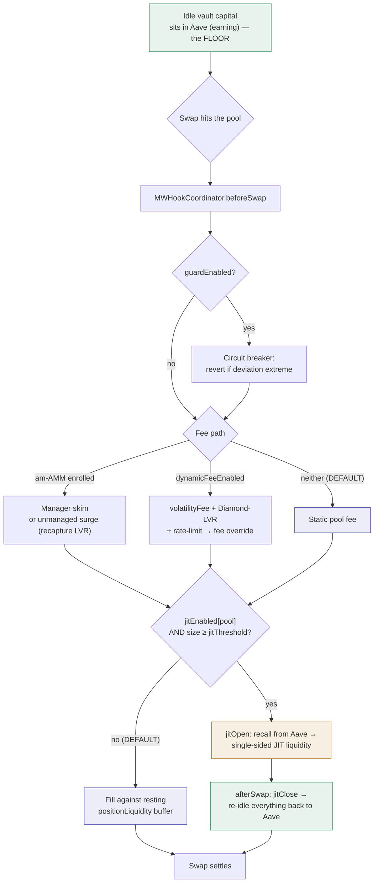

# ULV Swap Flow — what actually happens on a swap

**Verified from the contracts** (`contracts-v4/src/`, 2026-08-21) — this document answers the recurring
question *"money is in Aave and a trade happens… do we JIT?"* with what the deployed code actually does,
not the aspirational design notes. Every claim below cites a file + line.

---

## TL;DR

1. **Idle capital sits in Aave earning lending interest — the floor.** This is the reliable yield and
   most of the real return. It is *not* JIT.
2. **The pool also holds a resting liquidity buffer** (`positionLiquidity`,
   [`MintwareDeFiPairVault.sol:146`](../../contracts-v4/src/vaults/MintwareDeFiPairVault.sol)). Swaps
   trade against this by default.
3. **On a swap, the canonical hook (`MWHookCoordinator`) runs, in order:** circuit-breaker → fee
   (dynamic / am-AMM / Diamond-LVR) → *optional* size-gated JIT → (afterSwap) oracle update + JIT close.
4. **Every lever is per-pool, owner-set, and DEFAULT OFF.** With nothing enabled, a swap simply fills
   against the resting buffer at the pool's static fee — **no JIT, no dynamic fee**.
5. **JIT, when enabled, *is* Aave-funded** (recall → provide single-sided → re-idle), but it only fires
   when `jitEnabled[pool]` is on **and** the trade size ≥ `jitThreshold`.

So: **we do not JIT by default.** JIT is a narrow, owner-enabled, size-gated tool — consistent with the
empirical finding that naive always-on JIT nets ~break-even (fee ≈ adverse selection) and bleeds on thin
pools. The everyday value capture is meant to come from the fee / MEV-tax / LVR levers, not JIT.

---

## The two layers

| Layer | What it is | JIT? | Yield source |
|---|---|---|---|
| **1 — Floor** | Idle vault capital deposited in Aave (rehypothecation) | No | Aave lending interest — reliable, continuous |
| **2 — Swap** | The V4 pool the vault provides liquidity to | Optionally | Swap fee, priced by the fee/LVR/MEV levers; JIT is an optional top-up |

The mental model that causes confusion is "yank everything out of Aave for every trade." That is the
*naive* JIT that testing rejected. The real model is: **capital stays in Aave earning; the swap layer is
skimmed intelligently; JIT only fires selectively.**

---

## What actually fires on a swap — `MWHookCoordinator`

### `beforeSwap` ([`MWHookCoordinator.sol:265`](../../contracts-v4/src/hooks/MWHookCoordinator.sol))

1. **Circuit breaker** (only if `fp.guardEnabled`) — reverts swaps at extreme deviation from the
   truncated in-pool oracle (`:274`).
2. **Fee path** (mutually exclusive):
   - **am-AMM enrolled** (`amAmmEnabled[id]` && auction set) → `_beforeSwapAmAmm` (`:283`, `:323`): a
     manager skims the fee; **or** with no manager, the swap is deviation-priced (surge fee) so LVR is
     recaptured as LP fee (`:342`).
   - **else** → if `fp.dynamicFeeEnabled`: `MWDynamicFee.volatilityFee` (deviation-priced, `:291`) +
     **Diamond-LVR** directional surcharge on the arb direction only (`_lvrTarget`, `:294`/`:391`,
     applied only if `lvrParams[id].enabled`) + per-block rate-limit (`:295`/`:406`). If
     `dynamicFeeEnabled` is **false**, `feeOverride = 0` → the pool uses its **static fee**.
3. **Size-gated JIT** (composes *alongside* the fee path, `:305`): only if
   `jitEnabled[id]` && `vault != 0` && `outputBudget >= jitThreshold` → `vault.jitOpen(...)`, wrapped in
   `try/catch` (a revert/0-return is a silent fallback to resting liquidity). **No price is read** — the
   size comes only from `|amountSpecified|`.

### `afterSwap` ([`MWHookCoordinator.sol:422`](../../contracts-v4/src/hooks/MWHookCoordinator.sol))

- Advances the truncated oracle (`:428`) if the fee/guard is on.
- **Closes any JIT position** opened in `beforeSwap` (`vault.jitClose()`, `:433`), best-effort.

---

## Where JIT liquidity comes from — the direct answer

`jitOpen` ([`MintwareDeFiPairVault.sol:960`](../../contracts-v4/src/vaults/MintwareDeFiPairVault.sol)):

> *"Open a tight SINGLE-SIDED JIT position **funded from the OUTPUT-side Aave adapter** … Every early
> `return 0` is a clean no-op fallback: no JIT liquidity, and the swap fills against the resting
> `positionLiquidity` buffer."*

`jitClose` ([`:994`](../../contracts-v4/src/vaults/MintwareDeFiPairVault.sol)) removes the position, takes
both sides back, and **re-idles everything returned to the adapters** (back into Aave). A V4 settlement
nuance is handled by minting ERC-6909 claims for any shortfall (swept to Aave later by
`sweepJitClaims()`), so the swap always settles.

So, **when JIT is enabled and the trade is large enough**, the flow is exactly:

```
Aave (idle)  ──recall──►  single-sided JIT liquidity  ──capture fee──►  re-idle back to Aave
```

**When JIT is not enabled (the default), none of that happens** — the swap fills against the resting
`positionLiquidity` buffer and pays the pool's fee.

---

## Default state — everything is off until an owner turns it on

| Lever | Flag | Type | Default | Set by |
|---|---|---|---|---|
| Size-gated JIT | `jitEnabled[poolId]` | `mapping ⇒ bool` (`:120`) | **false** | `setJitEnabled` (onlyOwner, `:202`) |
| JIT size gate | `jitThreshold` | `uint256` (`:117`) | **0** (must be set when enabling JIT) | owner setter (`:196`) |
| Dynamic fee | `FeeParams.dynamicFeeEnabled` | `bool` (`:77` struct) | **false** | per-pool fee config |
| Circuit breaker | `FeeParams.guardEnabled` | `bool` | **false** | per-pool fee config |
| am-AMM auction | `amAmmEnabled[poolId]` | `mapping ⇒ bool` | **false** | owner |
| Diamond-LVR | `lvrParams[poolId].enabled` | `bool` | **false** | owner |

**Net:** on a freshly-deployed pool with nothing configured, a swap = resting-liquidity fill + static
fee. No JIT, no dynamic fee, no LVR surcharge. Each lever is enabled deliberately, per pool — which is
how the pool-tiering rule is enforced (JIT stays off on thin pools; the fee/LVR levers do the work).

---

## Corrections to older notes (verified 2026-08-21)

- **`_calculateDynamicFee` / `_rebalanceIdleCapital` are GONE**, not "dead no-ops." A grep of
  `contracts-v4/src` (excluding forge libs) returns nothing. The dynamic fee is **live, wired inline**
  in `beforeSwap` via `MWDynamicFee.volatilityFee` + `_lvrTarget` + `_rateLimitedFee`. Any note calling
  the dynamic fee a no-op is stale.
- The JIT-on-swap machinery **is** real and Aave-funded (above) — but gated and default-off, which
  reconciles the "ULV mechanics: idle in Aave · JIT-on-swap" description with the "naive JIT is a loser
  → JIT off, use fee/LVR" learning. Both are true: the capability exists; the default posture does not
  use it.

## Scope note

This traces the **DeFi / ULV** path (`MWHookCoordinator` + `MintwareDeFiPairVault` + Aave adapter). The
**YPN treasury** has its own separate JIT hook
([`MintwareTreasuryJitHook.sol`](../../contracts-v4/src/payments/MintwareTreasuryJitHook.sol)) with the
same *borrow-idle → JIT → settle atomically, junior backstops, off by default* pattern; it is not traced
line-by-line here.

---

## Diagram


