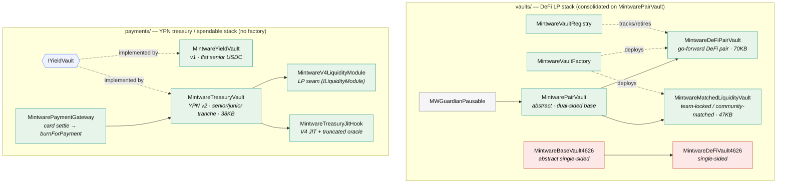

# Vault Architecture Map

_Map of the 9 vault contracts + factory/registry, their inheritance, status, and overlap._
_Generated 2026-08-15 from the `docs/ypn-mev-parked` branch. Companion to the consolidation plan._

## The two universes

The vault surface is **two parallel stacks that share no common base**:

- **`vaults/` — DeFi LP stack.** Consolidated onto one abstract base (`MintwarePairVault`) with a
  Factory + Registry. Multi-tenant. This side is in good shape (modulo dead weight).
- **`payments/` — YPN treasury / spendable stack.** A separate interface (`IYieldVault`),
  standalone single instances, **no factory/registry**. This is where the divergence lives.

**The two subgraphs never touch** — that is the finding. No shared base, no shared factory.

## Status & overlap table

| Contract | Dir | Base / iface | Status | Notes |
|---|---|---|---|---|
| `MintwarePairVault` | vaults/ | MWGuardianPausable + ReentrancyGuard | ✅ live base | The dual-sided base the DeFi side standardized on. Good. |
| `MintwareDeFiPairVault` | vaults/ | MintwarePairVault | ✅ live (canonical DeFi) | 70KB — largest contract; watch EIP-170. Go-forward per the single→pair retirement. |
| `MintwareMatchedLiquidityVault` | vaults/ | MintwarePairVault | ✅ live | Team-locked/community-matched ≥90d cliff. **Overlaps DeFiPairVault — clarify which is canonical.** |
| `MintwareBaseVault4626` | vaults/ | ERC-4626-ish abstract | ⛔ DEPRECATED (in-code) | Base for the single-sided vault. Dead weight → delete. |
| `MintwareDeFiVault4626` | vaults/ | MintwareBaseVault4626 | ⛔ DEPRECATED "DO NOT DEPLOY" | Known NAV/solvency flaw. Dead weight → delete. |
| `MintwareVaultFactory` | vaults/ | Ownable | ✅ live | Deploys via `IMintwareVaultInit`. **DeFi-only — YPN not wired.** |
| `MintwareVaultRegistry` | vaults/ | Ownable | ✅ live | `deactivateVault`/`active`. DeFi-only. |
| `MintwareTreasuryVault` | payments/ | IYieldVault | ✅ live (YPN v2) | Senior/junior tranche, price-free senior NAV, spendable. **Not ERC-4626, not on the factory.** |
| `MintwareYieldVault` | payments/ | IYieldVault | ✅ live (v1) | Flat senior USDC, no tranche. TreasuryVault "lifts its share math verbatim" → duplication. |

## The overlaps worth resolving (the consolidation targets)

1. **Dead weight — delete now (9 → 7).** `MintwareBaseVault4626` + `MintwareDeFiVault4626` are marked
   DEPRECATED / DO-NOT-DEPLOY in-code. They're pure audit-surface + confusion. (Plus the `FeeLib`/`LockLib`/
   dead FeeVault attestation noted elsewhere.) Nothing should reference them; delete + drop from registry.

2. **Two dual-sided vaults on one base — pick the canonical.** `MintwareDeFiPairVault` and
   `MintwareMatchedLiquidityVault` both extend `MintwarePairVault` and both do "dual-sided team + community."
   Either they are genuinely two products (document the boundary) or one subsumes the other (fold it in).
   70KB + 47KB of near-adjacent logic is a lot to keep in parallel.

3. **YPN share math duplicates `MintwareYieldVault`.** `MintwareTreasuryVault` "lifts the senior share math
   verbatim" from v1 rather than inheriting a shared `SeniorShares` base. Extract the senior-share/virtual-
   offset logic into one base both use — one place to audit the inflation defense.

4. **The big fork: is YPN a third vault family, or should it be on `MintwarePairVault`?** The YPN tranche
   vault genuinely differs (price-free senior par + spendable card rail + Aave rehypothecation + JIT seam),
   but it shares deposit/shares/LP-seam/junior-first-loss with `MintwarePairVault`. Decide explicitly:
   **(a)** fold YPN onto `MintwarePairVault` + give it a factory (one universe), or **(b)** declare YPN a
   separate product line with its own (new) factory and freeze cross-pollination. Today it is neither —
   which is what let a third family appear.

5. **YPN has no factory/registry.** The product whose model is "each team launches a vault with their own
   token" is the one *without* multi-tenant deployment. Whichever base wins in (4), YPN needs a factory.

## Recommendation

Resolve top-down: **(1) delete dead weight → (2) pick the canonical dual-sided vault → (3) extract the shared
senior-share base → (4) make the YPN-family decision → (5) give the winner a factory.** Steps 1–3 are
low-risk cleanup; 4 is the real architectural decision and everything else waits on it.
