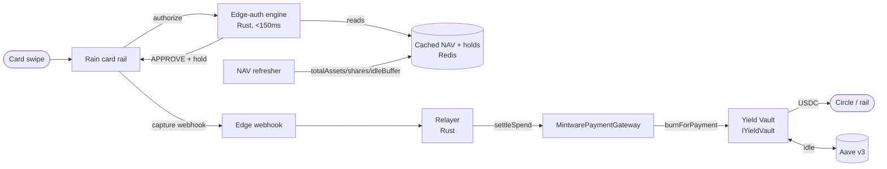

# YPN — Yield Payment Network: System Architecture

> **The one-liner:** a user's USDC sits in a yield vault and is *also* spendable at Visa — a card
> charge is authorized in <150 ms off a cached vault NAV, and settled asynchronously on-chain by
> burning exactly enough vault shares to pay the rail. The balance earns yield right up until it is
> spent; nothing is ever custodied off-chain.

This is the top-level map of the whole system — on-chain and off-chain — and the single source of
truth for what is **live**, what is **proven**, and what remains **deploy/infra-gated**. Component
specs live alongside their code (`docs/developers/ypn-*-spec.md`, `services/*/`).

---

## 1. The core design: two tiers

A card network needs a yes/no in well under a second; a blockchain settles in seconds. YPN splits
those concerns:

| Tier | Where | Latency | Job |
|---|---|---|---|
| **Authorization** | off-chain edge (Rust) | <150 ms | Decide APPROVE/DECLINE off a *cached* NAV; reserve a hold. Never moves funds. |
| **Settlement** | on-chain (Base) | seconds, async | On capture, burn the user's shares and pay the rail in USDC. The Gateway is the only mover of funds. |

The edge reserves spending capacity (a hold); the chain moves value. That separation is what makes
the whole thing both fast and non-custodial.



---

## 2. On-chain layer (Base Sepolia today)

### 2.1 The settlement boundary — `IYieldVault`

Everything on-chain talks to the vault through one tiny interface, so the Gateway never needs to know
what backs the shares:

```solidity
function idleBuffer()        external view returns (uint256);              // USDC withdrawable now
function previewWithdraw(uint256 assets) external view returns (uint256);  // shares for `assets` (rounds UP)
function burnForPayment(address user, uint256 shares, address receiver)    // onlyGateway; USDC -> rail
        external returns (uint256 assetsRedeemed);
```

### 2.2 v1 payment core (LIVE + on-chain-verified)

The minimal, **price-free** stack that settlements run against today:

- **`AaveV3YieldAdapter`** — idle USDC → Aave v3 (yield), best-effort withdraw on the hot path.
- **`MintwareYieldVault`** — single-asset USDC ERC-4626-style vault; the native `IYieldVault`. Price-
  free by construction (one asset), symmetric virtual-offset inflation defense, every division rounds
  toward the vault.
- **`MintwarePaymentGateway`** — `AccessControl` + EIP-712. Verifies a user's long-lived
  `DelegatedSpendPermit` (and, for ≥ $250, a short-lived edge `ShortLivedHoldAuth`), enforces daily
  caps + hold idempotency, then calls `burnForPayment`. **No custody** — USDC flows vault → rail
  directly. Nonce is revocation-only (long-lived permits are reusable).

### 2.3 v2 treasury-anchored ULV (invariant-proven, not yet deployed)

The differentiated vault behind the *same* `IYieldVault` seam — a **structured tranche vault**:

- **Senior = community USDC** — par + yield, **price-free**, card-spendable. Counts its deployed LP
  portion at PAR, never mark-to-market.
- **Junior = team/treasury locked reserve** — first-loss; absorbs price + impermanent loss.

Community USDC idles in Aave (default 80%) with the rest deployed as junior-covered LP. Headline
invariant (fuzzed 256×128k): `deployedFromSenior ≤ recoverableUSDC` — the junior always covers the
senior. Swapping v2 behind the Gateway is a vault change with **zero Gateway change**.

### 2.4 Live addresses (Base Sepolia, 84532)

| Contract | Address |
|---|---|
| `MintwareYieldVault` | `0x7d92083dc80627d89a2ced1d911ac2bc1eb2b4df` |
| `MintwarePaymentGateway` | `0x26ce3baff473b24e8afe932dfb6d68adca8048b0` |
| `AaveV3YieldAdapter` (USDC) | `0xc9c831b88e853c0cb4ca520dcfe0557b48506eac` |
| Deployer / roles holder | `0x7fD88B026B65B9f54FFE694bB422bBCC504D7E06` |
| USDC (Aave-market) / aUSDC | `0xba50…4D5f` / `0x10F1…0ACC` |

---

## 3. Off-chain layer (Rust)

### 3.1 Edge-auth engine (`services/edge-auth`)

The head of the pipeline — sub-150 ms authorization, no chain call in the hot path.

- **`ledger.rs`** — the decision. APPROVE iff the charge clears **all** of: per-user equity (net of
  the user's holds), the daily cap (net of spent + reserved), and **global settlement liquidity**
  (`idleBuffer` net of *all* holds — so every hold stays settleable). Distinct decline reason per gate.
- **`nav.rs`** — cached NAV; equity mirrors the vault's price-free `convertToAssets` (round down, never
  over-credit) + a staleness guard (fail safe → decline on a stale snapshot). Carries a
  `VaultCollateral` seam (USDC identity today; ETH dark — see §7).
- **`store.rs` / `redis_lua.rs`** — the hold store. In-memory `MemStore` (atomic reserve under one
  lock) for single-instance; the Redis atomic-reserve **Lua scripts** (RESERVE/SETTLE/RELEASE) for
  many instances (heavy equity math stays in Rust; Lua does only the atomic add/compare + counter
  updates + expiry prune).
- **`chain.rs` / `refresher.rs`** — polls the vault's `totalAssets`/`totalShares`/`idleBuffer` and each
  user's shares into the cache. A stalled refresher makes auths fail safe, not run stale.
- **`signer.rs`** — EDGE_SIGNER: signs the EIP-712 `ShortLivedHoldAuth` for ≥ $250 charges (the
  Gateway's high-value branch). Its address must hold `EDGE_SIGNER_ROLE`.
- **`webhook.rs`** — Rain ingest (`POST /webhooks/rain`), HMAC-verified: capture → settle, reversal →
  release.

HTTP surface: `POST /authorize`, `GET /health`, `GET /holds/:id`, `POST /webhooks/rain`.

### 3.2 Relayer (`services/relayer`)

Turns an edge-approved + captured hold into the on-chain `settleSpend` call: assembles the user's
permit + (for high-value) the edge auth, ABI-encodes the exact call the Gateway expects, and submits
it (relayer wallet holds `RELAYER_ROLE`). The encoding is proven byte-exact against the **live**
Gateway (an `eth_call` dispatches + decodes all 8 args, reverting only at ECDSA recovery on a dummy
signature).

---

## 4. End-to-end flows

- **Deposit** — user deposits USDC → `vault.deposit` → senior shares; USDC idles into Aave. The
  balance now earns yield *and* is spendable.
- **Authorize (<150 ms)** — Rain → `POST /authorize` → edge reads cached NAV + holds → `ledger` decides
  → on APPROVE reserve a hold (+ for ≥ $250, sign an edge auth) → return.
- **Capture → settle** — Rain capture webhook → edge settles the hold → relayer submits
  `gateway.settleSpend` → `burnForPayment` withdraws from Aave (or unwinds LP in v2) → USDC to the rail.
- **Redeem** — a user can redeem their own shares for USDC any time (`redeemSenior`/`redeem`), same NAV
  math — deposits stay honestly liquid outside the card rail.

---

## 5. Security & trust model

- **No off-chain custody.** The edge only reserves capacity; only the Gateway moves funds, and only
  vault → rail.
- **Price-free money path.** A USDC share is ~$1, so authorization needs no oracle and settlement is
  exact. This is the system's core safety property (see §7 before trading it away).
- **Permit + roles.** A long-lived `DelegatedSpendPermit` (revocation-only nonce) authorizes spending;
  ≥ $250 additionally needs a short-lived `EDGE_SIGNER_ROLE` signature; only `RELAYER_ROLE` submits
  settlements. Daily caps + hold idempotency bound abuse; the Gateway re-checks everything on-chain.
- **Fail safe.** Stale NAV/price → decline. The edge can never approve something the Gateway would
  revert (it gates on cached `idleBuffer` net of all holds).

---

## 6. Status — live / proven / gated

| Piece | State |
|---|---|
| v1 payment core (adapter/vault/gateway) | ✅ **deployed + cast-verified** on Base Sepolia |
| Full settle path (permit → settleSpend → burnForPayment) | ✅ proven on-chain (smoke route, PR #217) |
| v2 treasury tranche vault | ✅ invariant-proven (256×128k); ⛔ not deployed (external audit first) |
| Edge-auth: decision / store / NAV / signer / webhook | ✅ built + proven, 55 tests (PR #218) |
| Edge-auth: on-chain NAV read | ✅ proven vs the live vault |
| Redis atomic-reserve Lua | ✅ proven via embedded Lua + mock Redis |
| Relayer settleSpend encoding | ✅ proven offline **and** vs the live Gateway (PR #219) |
| Multi-collateral (ETH) seam | ✅ present, **dark** (§7) |

**Deploy/infra-gated (remaining ops):** thin Rust `RedisStore` EVALSHA wrapper (needs a Redis);
relayer tx build/sign/send (needs a funded relayer + on-chain hold); live Rain credentials/webhook
format; production key management (KMS/HSM for the EDGE_SIGNER + relayer keys); external audit before
mainnet / real value.

---

## 7. Multi-collateral (the dark seam)

The edge NAV is collateral-aware (`VaultCollateral { Usdc | Eth { price, haircut, price_age } }`), but
**only USDC is enabled** — it is the price-free identity. Turning on ETH/WETH/LSTs (more TVL) trades
price-freeness for oracle + price risk and is **gated on**: (a) the USDC base audited and with TVL,
(b) a settlement path that redeems ETH → **swaps to USDC** at settle (slippage in the haircut), (c) an
oracle + price-staleness design, (d) an LTV haircut `γ` VaR-modeled to cover intra-hold drawdown +
settlement slippage, per-asset and governance-tunable. Seam now, ship later.

---

## 8. Reference

- **Specs:** `ypn-v1-foundation-spec.md`, `ypn-v2-treasury-vault-spec.md`, `ypn-edge-auth-spec.md`.
- **Crates:** `services/edge-auth` (auth), `services/relayer` (settlement). Detached workspaces; build
  with `cargo` inside each. Not in the JS/Forge CI yet — add a `cargo test` job when wiring ops.
- **Deploy routes (Privy server wallet, bearer/`CRON_SECRET`):**
  `POST /api/oracle/deploy-ypn-v1-testnet`, `POST /api/oracle/smoke-ypn-v1-testnet`.
- **Key env:** `EDGE_RPC_URL`, `EDGE_VAULT_ADDRESS`, `EDGE_USERS`, `EDGE_MAX_NAV_AGE_SECS`,
  `EDGE_HOLD_TTL_SECS`, `EDGE_SIGNER_KEY`, `EDGE_GATEWAY_ADDRESS`, `EDGE_CHAIN_ID`,
  `EDGE_RAIN_WEBHOOK_SECRET`; relayer `RELAYER_RPC_URL`, `RELAYER_KEY`.
