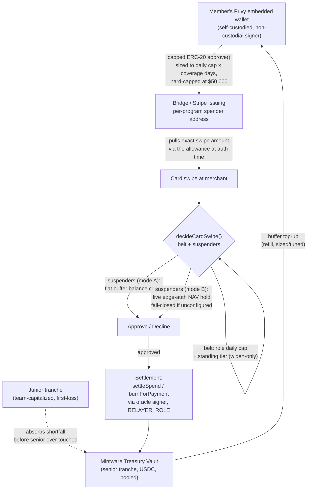

# RD-1 — Funds Flow Document

## Diagram

## Narrative walkthrough

1. **Funding wallet.** Each card is funded from the member's own Privy embedded wallet — one wallet, one card (Bridge's own rule, which matches how `card_spend_buffers` is scoped 1:1 per card). The member holds the wallet; Mintware never holds a private key that can move 100% of a member's balance unilaterally.

2. **The allowance, not a balance transfer.** The funding wallet grants a plain ERC-20 `approve(spender, allowance)` on USDC to a per-program Bridge-provisioned spender address. This is a **capped standing pull-right**, not an unlimited approval: the allowance is sized to `dailyCapAtomic × coverageDays` (default 7 days), floored at one day's cap, and — critically — hard-ceilinged at **$50,000 absolute maximum**, and further scoped down to a multiple of the intended buffer target when one is configured. Bridge can never pull more than this capped amount, regardless of what else sits in the wallet.

3. **At swipe time**, Bridge/Stripe pulls the exact authorized amount via that allowance — it reads the wallet's real on-chain USDC balance, never a vault NAV computation (a live AMM-priced NAV read cannot complete inside a card network's ~6-second authorization window, which is why the buffer model exists at all).

4. **The authorization decision** (`decideCardSwipe`) runs belt-and-suspenders, checked in this order:
   - **Belt:** the member's role-based daily spend cap (from a fixed role-preset policy), summed against that member's actual approved spend so far *that day* — not just the current swipe — plus an optional "standing" tier that can only ever *widen* a limit within the existing hard cap, never remove or bypass it.
   - **Suspenders — two modes, mutually exclusive per card:**
     - **Buffer mode** (flag-gated): an atomic, row-locked check-and-reserve against a pre-funded flat balance — deterministic, meets card-network latency.
     - **Edge-auth mode** (default): a live NAV-based hold against the member's actual vault equity, computed by the Rust edge-auth service. **Fails closed** if edge-auth isn't configured — a card never silently default-approves because a downstream service is unreachable.

5. **Where the buffer/vault money actually sits.** The USDC the buffer draws from originates in `MintwareTreasuryVault` — a senior/junior tranche structure. Community-facing senior capital is the par-protected, spendable claim; the team's own junior capital is contractually first-loss and is drawn down **before** senior capital in any shortfall (code-enforced, not discretionary — see the vault's own redemption-waterfall ordering).

6. **Settlement** (the actual on-chain burn-shares-and-pay leg, `settleSpend`/`burnForPayment`) is executed by a designated oracle signer holding a specific on-chain role, not an arbitrary hot wallet.

## Custody characterization

Mintware's card program is non-custodial. The card funding wallet is the member's own Privy-embedded
wallet — self-custodied, with no single Mintware-controlled key capable of moving it unilaterally. The
underlying treasury position is likewise not held in a Mintware-controlled bank account: it is a
smart-contract-governed pool, with depositor claims enforced by contract logic rather than by Mintware
custody. Mintware at no point holds a private key or account that can unilaterally move user funds.
